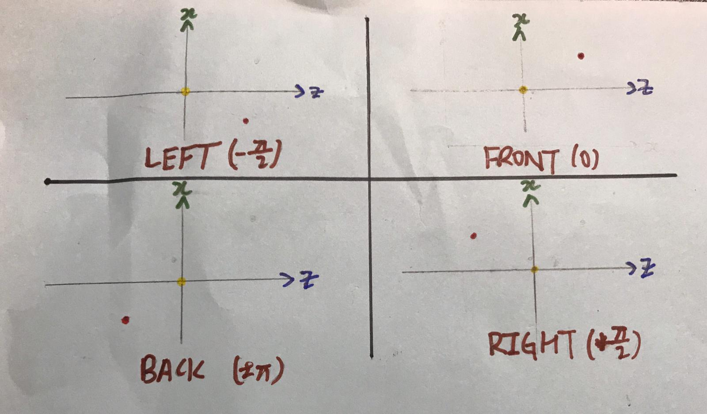
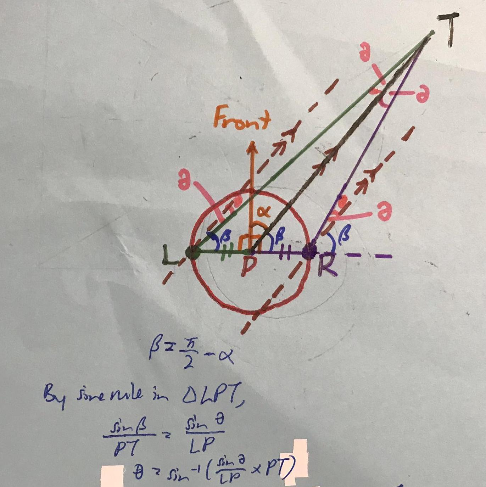
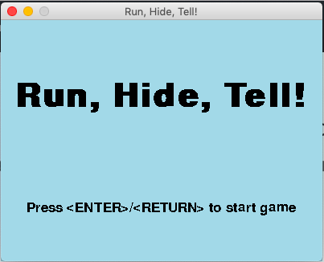
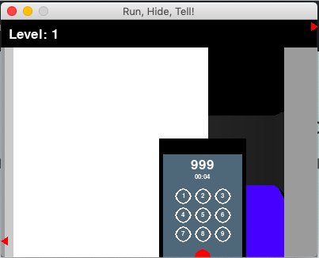
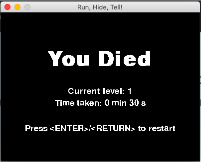

## Project Title
Run, Hide, Tell!

---
## Description
This is a game which educates its players about the procedures
(Run, Hide and Tell) to follow during a terrorist attack.

---
## Motivations
Since our project has to be for social good, we thought that we could make an
educational game such that people can be more aware about what to do during a
terrorist attack.

---
## Using this branch
Read the write-up first.

`2d_demonstration`: demonstration of 2d engine

`3d_demonstration`: demonstration of 3d engine

`finalgame`: our end product with all the features
- **commented code is found here**

`freeroam`: our end product but with death, terrorists and civilians turned off

`mapmaker`: mapmaker

---
## Explanation of coordinate system, angles and states

The **x-coordinate** corresponds to the position of the object on the **horizontal axis** of the map, increasing from _left to right_.
The **z-coordinate** corresponds to the position of the object on the **vertical axis** of the map, increasing from _top to bottom_.
The **y-coordinate** gives the **height** of the object.

Initially, the player sprite will be facing to the **right**.
At this stage, it will have an angle of **0 (0º)** – **state 1**.

When the player turns left (anticlockwise), the angle decreases.
Thus at **-π/2 (-90º)**, the player sprite will be facing the **top** of the map - **state 3**.

When the player turns right (clockwise), the angle increases.
Thus at **π/2 (90º)**, the player sprite will be facing the **bottom** of the map - **state 2**.

At **±π (±180º)**, the player sprite will be facing the **left** of the map – **state 0**

---
## Build Status
Game mechanics
* Controlling the movement of the player sprite: `Working`
* Controlling the turning of the player sprite: `Working`
* Shooting mechanism for terrorists: `Building`
  * Sometimes the bullets will still shoot through the walls
* Preventing players from walking into walls: `Working`
* Sighting and aiming mechanism for terrorists: `Working`
* Movement of terrorists: `Working`
* Movement of civilians: `Working`
* Hearing mechanism: `Building`
  * Works, but will result in `NULL tstate` error
* Calling the police: `Working`

Mapmaker
* Mapmaker to create maps: `Working`

Pseudo-3D representation
* Converting 2d coordinates to 3d coordinates: `Working`
* Creating basic objects and shapes: `Working`
* Creating converging sceneries: `Working`
* Allowing for movement and turning: `Working`
* Drawing pseudo-3d walls and floor (integration): `Working`
* Drawing pseudo-3d figures (intergration): `Building`

Additional game features
* Start and end screens: `Working`
* Menu bar: `Working`
* Phone (when calling): `Working`

---
## Features

#### 3d to Pseudo-3d conversion
The initial location of the camera is positioned at (3, 17, 0),
which is derived from the position of the eyes on an actual person.

The angle of the 3D coordinate from the camera is measured, then it is used together with the dimensions of the screen and the field of view of the player to determine the pseudo-3d coordinate.

```python
# in bet3d.py
def getX(vector):
    pointX = vector[0] - _eyeX
    pointY = 0
    pointZ = vector[2] - _eyeZ

    extendX = pointX
    extendY = 0
    extendZ = 0

    if (extendX, extendY, extendZ) == (0, 0, 0):
        if pointX == 0 and pointZ == 0:
            angle = 0
        else:
            if pointX == 0:
                angle = 90
    else:
        pointVector = pygame.math.Vector3(pointX, pointY, pointZ)
        extendVector = pygame.math.Vector3(extendX, extendY, extendZ)
        angle = pointVector.angle_to(extendVector)

    if pointX < 0:
        angle = (180 - angle) % 180
    if pointZ < 0:
        angle *= -1

    translatedX = (_fovX / 2 + angle) / _fovX * _screenWidth
    return translatedX

def getY(vector):
    pointX = vector[0] - _eyeX
    pointY = vector[1] - _eyeY
    pointZ = 0

    extendX = pointX
    extendY = 0
    extendZ = pointZ

    if (extendX, extendY, extendZ) == (0, 0, 0):
        angle = 90
    else:
        pointVector = pygame.math.Vector3(pointX, pointY, pointZ)
        extendVector = pygame.math.Vector3(extendX, extendY, extendZ)

        angle = pointVector.angle_to(extendVector)

    if pointX < 0:
        angle = 180 - angle
    if pointY > 0:
        angle *= -1

    translatedY = (_fovY / 2 + angle) / _fovY * _screenHeight
    return translatedY

def Get(vector):
    return(getX(vector), getY(vector))
```

#### Drawing Pseudo-3d shapes
Firstly, the lengths and vertices of the cuboid have to be determined,
and then altered based on the diagram below:


_The yellow dot indicates the location of the camera, which is pointing in the x-direction (indicated by green). The red dot indicates the location of the object._

Then, based on the position of the object,
the program decides which surfaces to blit.

| Object Location |Right face |Front face |Bottom face| Top face  |
|      :---:      |   :---:   |   :---:   |   :---:   |   :---:   |
|  **Top-right**  |           |     √     |     √     |     √     |
|  **Top-left **  |     √     |     √     |     √     |           |
|**Bottom-left ** |     √     |     √     |           |     √     |
|**Bottom-right** |     √     |           |     √     |     √     |


```python
# in raw3d.py
def cuboid(screen, corner1, corner2, state, colorscheme = "normal", brightness = 1):
    lenX = corner1[0] - corner2[0]
    lenY = corner1[1] - corner2[1]
    lenZ = corner1[2] - corner2[2]

    verticeA = corner1
    verticeB = (verticeA[0] - lenX, verticeA[1], verticeA[2])
    verticeC = (verticeB[0], verticeB[1] - lenY, verticeB[2])
    verticeD = (verticeC[0] + lenX, verticeC[1], verticeC[2])

    verticeE = (verticeA[0], verticeA[1], verticeA[2] - lenZ)
    verticeF = (verticeB[0], verticeB[1], verticeB[2] - lenZ)
    verticeG = (verticeC[0], verticeC[1], verticeC[2] - lenZ)
    verticeH = (verticeD[0], verticeD[1], verticeD[2] - lenZ)

    if state == 1:
        bet._eyeX = bet._OGeyeX
        bet._eyeZ = bet._OGeyeZ
    elif state == 2:
        oldX = bet._OGeyeX
        oldZ = bet._OGeyeZ

        bet._eyeX = oldZ
        bet._eyeZ = -oldX

        verticeA = (verticeA[2], verticeA[1], -verticeA[0])
        verticeB = (verticeB[2], verticeB[1], -verticeB[0])
        verticeC = (verticeC[2], verticeC[1], -verticeC[0])
        verticeD = (verticeD[2], verticeD[1], -verticeD[0])
        verticeE = (verticeE[2], verticeE[1], -verticeE[0])
        verticeF = (verticeF[2], verticeF[1], -verticeF[0])
        verticeG = (verticeG[2], verticeG[1], -verticeG[0])
        verticeH = (verticeH[2], verticeH[1], -verticeH[0])

    elif state == 3:
        bet._eyeX = -bet._OGeyeX
        bet._eyeZ = -bet._OGeyeZ

        verticeA = (-verticeA[0], verticeA[1], -verticeA[2])
        verticeB = (-verticeB[0], verticeB[1], -verticeB[2])
        verticeC = (-verticeC[0], verticeC[1], -verticeC[2])
        verticeD = (-verticeD[0], verticeD[1], -verticeD[2])
        verticeE = (-verticeE[0], verticeE[1], -verticeE[2])
        verticeF = (-verticeF[0], verticeF[1], -verticeF[2])
        verticeG = (-verticeG[0], verticeG[1], -verticeG[2])
        verticeH = (-verticeH[0], verticeH[1], -verticeH[2])

    elif state == 0:
        oldX = bet._OGeyeX
        oldZ = bet._OGeyeZ

        bet._eyeX = -oldZ
        bet._eyeZ = oldX

        verticeA = (-verticeA[2], verticeA[1], verticeA[0])
        verticeB = (-verticeB[2], verticeB[1], verticeB[0])
        verticeC = (-verticeC[2], verticeC[1], verticeC[0])
        verticeD = (-verticeD[2], verticeD[1], verticeD[0])
        verticeE = (-verticeE[2], verticeE[1], verticeE[0])
        verticeF = (-verticeF[2], verticeF[1], verticeF[0])
        verticeG = (-verticeG[2], verticeG[1], verticeG[0])
        verticeH = (-verticeH[2], verticeH[1], verticeH[0])

    posX = 0
    posY = 0
    if verticeE[2] > bet._eyeZ:
        posX = 1
    elif verticeA[2] < bet._eyeZ:
        posX = -1
    else:
        posX = 0

    if verticeC[1] < bet._eyeY:
        posY = 1
    elif verticeA[1] > bet._eyeY:
        posY = -1
    else:
        posY = 0

    verticeA = bet.Get(verticeA)
    verticeB = bet.Get(verticeB)
    verticeC = bet.Get(verticeC)
    verticeD = bet.Get(verticeD)
    verticeE = bet.Get(verticeE)
    verticeF = bet.Get(verticeF)
    verticeG = bet.Get(verticeG)
    verticeH = bet.Get(verticeH)

    if state == 1:
        faceRight = [verticeA, verticeB, verticeC, verticeD]
        faceLeft = [verticeE, verticeF, verticeG, verticeH]
        faceBack = [verticeB, verticeC, verticeG, verticeF]
        faceFront = [verticeA, verticeD, verticeH, verticeE]
        faceTop = [verticeA, verticeB, verticeF, verticeE]
        faceBottom = [verticeD, verticeC, verticeG, verticeH]

    elif state == 2:
        faceFront = [verticeE, verticeF, verticeG, verticeH]
        faceBack = [verticeA, verticeB, verticeC, verticeD]
        faceRight = [verticeA, verticeD, verticeH, verticeE]
        faceLeft = [verticeB, verticeC, verticeG, verticeF]
        faceTop = [verticeA, verticeB, verticeF, verticeE]
        faceBottom = [verticeD, verticeC, verticeG, verticeH]

    elif state == 3:
        faceLeft = [verticeA, verticeB, verticeC, verticeD]
        faceRight = [verticeE, verticeF, verticeG, verticeH]
        faceFront = [verticeB, verticeC, verticeG, verticeF]
        faceBack = [verticeA, verticeD, verticeH, verticeE]
        faceTop = [verticeA, verticeB, verticeF, verticeE]
        faceBottom = [verticeD, verticeC, verticeG, verticeH]

    elif state == 0:
        faceFront = [verticeA, verticeB, verticeC, verticeD]
        faceBack = [verticeE, verticeF, verticeG, verticeH]
        faceRight = [verticeB, verticeC, verticeG, verticeF]
        faceLeft = [verticeA, verticeD, verticeH, verticeE]
        faceTop = [verticeA, verticeB, verticeF, verticeE]
        faceBottom = [verticeD, verticeC, verticeG, verticeH]

    tblue = BLUE
    tgreen = GREEN
    tblack = BLACK

    if colorscheme == "black":
        tblue = BLACK
        tgreen = BLACK

    if colorscheme == "white":
        tblue = WHITE
        tgreen = WHITE
        tblack = WHITE

    tblue = tuple([brightness*x for x in tblue])
    tgreen = tuple([brightness * x for x in tgreen])
    tblack = tuple([brightness * x for x in tblack])

    if posX == -1 and posY == -1:
        pygame.draw.polygon(screen, tblue, faceRight)
        pygame.draw.polygon(screen, tgreen, faceFront)
        pygame.draw.polygon(screen, tblack, faceBottom)
    elif posX == 1 and posY == -1:
        pygame.draw.polygon(screen, tblue, faceLeft)
        pygame.draw.polygon(screen, tgreen, faceFront)
        pygame.draw.polygon(screen, tblack, faceBottom)
    elif posX == 1 and posY == 1:
        pygame.draw.polygon(screen, tblue, faceLeft)
        pygame.draw.polygon(screen, tgreen, faceFront)
        pygame.draw.polygon(screen, tblack, faceTop)
    elif posX == -1 and posY == 1:
        pygame.draw.polygon(screen, tblue, faceRight)
        pygame.draw.polygon(screen, tgreen, faceFront)
        pygame.draw.polygon(screen, tblack, faceTop)
    elif posX == 0 and posY == 1:
        pygame.draw.polygon(screen, tgreen, faceFront)
        pygame.draw.polygon(screen, tblack, faceBottom)
    elif posX == 0 and posY == -1:
        pygame.draw.polygon(screen, tgreen, faceFront)
        pygame.draw.polygon(screen, tblack, faceTop)
    elif posX == 1 and posY == 0:
        pygame.draw.polygon(screen, tblue, faceLeft)
        pygame.draw.polygon(screen, tgreen, faceFront)
    elif posX == -1 and posY == 0:
        pygame.draw.polygon(screen, tblue, faceRight)
        pygame.draw.polygon(screen, tgreen, faceFront)
    elif posX == 0 and posY == 0:
        pygame.draw.polygon(screen, tgreen, faceFront)
```

#### Terrorist detecting mechanism for player
Initially we wanted to play a sound when the player is near the terrorist,
such that the player will know the approximate location of the terrorist.

This is done by looking at the difference in distances to the terrorist from the
left and right edges of the player, using some simple trigonometry.


_Line PT is the distance between the player (P) and the terrorist (T). We can see that the magnitude of the angle should be inversely proportional to the volume produced, thus the ratio between the louder volume and the softer volume would be π/2-(beta-theta):π/2-(beta+theta)_

```python
# in human.py
# is commented out in the 2D code
class Player(Human):
    # ...
    def hear(self):
        l_vol, r_vol = 0, 0
        total_vol = 0
        t_nearby = 0
        for t in self.game.terrorists.sprites():
            t_dist = distance((self.loc.x, self.loc.z), (t.loc.x, t.loc.z))
            t_phi = math.atan2(self.loc.z-t.loc.z, self.loc.x-t.loc.x)
            if t_dist == 0:
                total_vol = 1
                l_vol, r_vol = 1, 1
            elif t_dist <= HEARING_RADIUS:
                t_nearby += 1
                alpha = signed_basic_angle(self.front-t_phi)
                beta = math.pi/2-abs(alpha)
                theta = math.asin(math.sin(beta)*(TILESIZE/2)/t_dist)
                total_vol = 1-t_dist/HEARING_RADIUS if total_vol == 0 else (1-t_dist/HEARING_RADIUS+total_vol)/2
                softer_vol = 2*(math.pi/2-beta+theta)/math.pi
                louder_vol = 2*(math.pi/2-beta-theta)/math.pi
                if alpha > 0:
                    l_vol = softer_vol if l_vol == 0 else (l_vol+softer_vol)/2
                    r_vol = louder_vol if r_vol == 0 else (r_vol+louder_vol)/2
                else:
                    l_vol = louder_vol if l_vol == 0 else (l_vol+softer_vol)/2
                    r_vol = softer_vol if r_vol == 0 else (r_vol+softer_vol)/2
        self.game.footsteps.set_volume(total_vol/2)
        self.game.sound_channel.set_volume(l_vol, r_vol)
        self.game.sound_channel.play(self.game.footsteps)  
```

However, due to all the processes that were running, pygame's mixer module
kept producing a `NULL tstate` error.
Thus, we had to settle for another method, which is to use markers on the edge
of the screen which will indicate the approximate direction of the terrorists.

The `math.sin()` and `math.cos()` functions shift the markers proportionally to
the angle between the front of the player and the terrorist, while adding
`WIDTH//2` and `HEIGHT//2` ensures that the marker is in the middle when the
terrorist is directly to the front/back/left/right of the player.

```python
# in human.py
class Player(Human):
    # ...
    def detect_terrorists(self):
        for t in self.game.terrorists.sprites():
            t_dist = distance((self.loc.x, self.loc.z), (t.loc.x, t.loc.z))
            if t_dist <= DETECTION_RADIUS:
                angle_diff = self.front - math.atan2(self.loc.z-t.loc.z, self.loc.x-t.loc.x)
                if in_range(angle_diff, -math.pi/4, math.pi/4):
                    arrow_orientation = "down"
                    arrow_x = WIDTH*math.sin(angle_diff)+WIDTH//2
                    arrow_y = HEIGHT
                if in_range(angle_diff, math.pi/4, 3*math.pi/4):
                    arrow_orientation = "right"
                    arrow_x = WIDTH
                    arrow_y = HEIGHT*math.cos(angle_diff)+HEIGHT//2
                if in_range(angle_diff, -3*math.pi/4, -math.pi/4):
                    arrow_orientation = "left"
                    arrow_x = 0
                    arrow_y = HEIGHT*math.cos(-angle_diff)+HEIGHT//2
                if angle_diff < -3*math.pi/4 or angle_diff > 3*math.pi/4:
                    arrow_orientation = "up"
                    arrow_x = -WIDTH*math.sin(-angle_diff)+WIDTH//2
                    arrow_y = MENU_HEIGHT
                self.game.arrows.append([arrow_orientation, arrow_x, arrow_y])
```

#### Sighting mechanism for terrorists
Firstly we have to check which civilians the terrorist is able to spot,
and this is done in the `see()` method.
All the obstacles that are in range of the terrorist's sight are collated before
the program checks for the civilians.
If the civilian appears in the range of sight of the terrorist,
he will be detected no matter how far away he is from the terrorist,
but if it is not, those that are outside a certain radius will not be detected.
Afterwards, the program checks if the civilians are blocked by an obstacle
by drawing a line between the terrorist and each detected civilian
and seeing if it intersects the 2 diagonals of each wall.
Those that are not blocked will be returned.

In the `search_aim()` function, if the terrorist does not detect any civilians,
it will simply continue moving.
Or else, it will look for the closest civilian to start shooting.
When it is shooting, it will not move until the person is killed,
or after a certain amount of time which indicates that there is some other
reason that it is not able to shoot the target,
in this case the terrorist will move on and shoot his next target.

```python
# in human.py
class Terrorist(Human):
    # ...
    def search_aim(self):
        can_see = self.see()
        if len(can_see) == 0:
            self.move = True
            return
        orig_front = self.front
        min_dist = WIDTH
        to_turn = 0
        person_seen = False
        for person in can_see:
            dist = distance((self.loc.x, self.loc.z), person["pos"])
            if dist < min_dist:
                min_dist = dist
                target = person
                person_seen = True
        if not(person_seen):
            return
        self.front = target["phi"]
        self.shoot_count += 1
        if target["person"].alive() and self.shoot_count <= MAX_SHOOT_TIME:
            if self.shoot_count%SHOOT_INTERVAL == 0:
                self.shoot()
                self.move = False
        else:
            self.shoot_count = 0
            target = None
            self.move = True
        self.front = orig_front

    def see(self):
        in_range_obs = []
        for obstacle in self.game.obstacles.sprites():
            phi = math.atan2(
                obstacle.loc.z-self.loc.z,
                obstacle.loc.x-self.loc.x
            )
            if in_range(phi, self.front-SIGHT_RANGE, self.front+SIGHT_RANGE):
                in_range_obs.append(obstacle)
        good_people = self.game.civilians.sprites() + [self.game.player]
        can_see = []
        for person in good_people:
            phi = math.atan2(
                person.loc.z-self.loc.z,
                person.loc.x-self.loc.x
            )
            self_pos = (self.loc.x, self.loc.z)
            person_pos = (person.loc.x, person.loc.z)
            dist_person = distance(self_pos, person_pos)
            person_visible = True
            if not in_range(phi, self.front-SIGHT_RANGE, self.front+SIGHT_RANGE):
                if dist_person > SIGHT_RADIUS:
                    continue
            for obstacle in in_range_obs:
                intersect_diag1 = lines_intersect(
                    self_pos,
                    person_pos,
                    obstacle.rect.topleft,
                    obstacle.rect.bottomright
                )
                intersect_diag2 = lines_intersect(
                    self_pos,
                    person_pos,
                    obstacle.rect.topright,
                    obstacle.rect.bottomleft
                )
                if intersect_diag1 or intersect_diag2:
                    person_visible = False
                    break
            if person_visible:
                can_see.append({"person": person, "phi": phi, "pos": person_pos})
        return can_see  
```

---
## Screenshots

These screenshots are obtained from running the code in `finalgame`.


##### Start screen


##### Screenshot of the gameplay
- _Note the arrows at the edges which indicate the general direction of the terrorists, and the phone which appears while the player calls the police_


##### End screen upon failing a level (getting shot)

---
## Installation
Firstly, ensure that python3 is installed on your computer.
If not, you can install it [here](https://www.python.org/downloads/).

Secondly, ensure that you have downloaded the following files and folders for
the program (full set in `finalgame`)
* `assets` – containing the soundtrack that plays when terrorists are near
  the player
  *  `footsteps.wav` – the soundtrack that plays when terrorists are near the
  player
* `maps` – containing the set ups for the different levels for the game
  * `1.txt` – Level 1
  * `2.txt` – Level 2
  * `3.txt` – Level 3
  * `4.txt` – Level 4
  * `5.txt` – Level 5
* `main.py` – containing the main `Game` class for the program
* `human.py` – containing the `Player`, `Terrorist` and `Civilian` sprites
* `obstacle.py` – containing the `Obstacle` sprite
* `bullet.py` – containing the `Bullet` sprite
* `settings.py` - containing the constants used in the various programs
* `math_func.py` – containing the mathematical functions used in the programs
* `bet.py` – containing the `Get()` function which converts 2D coordinates to
  3D coordinates
* `raw.py` – containing functions to blit pseudo-3D shapes

Last but not least, ensure that you have downloaded pygame version 1.9.5.
If not, you can follow the instructions [here](https://www.pygame.org/wiki/GettingStarted)

---
## How to use?

#### General instructions applicable to both versions
The game may simply be run by running ```main.py```.

When the game runs, a start screen is shown.
Press `ENTER`/`return` to play the game.

The player can move forward and backwards by pressing the `W` and `A` keys
respectively, white turning is achieved with the left and right arrow keys.

#### Instructions in the 2d code
In order to win the game, the player has to press the `E` key to call the police.
The call will take 10 seconds, during which the player will not be able to move,
but he can still be shot by the terrorists.
After the 10 seconds, the police will take 30 seconds to arrive, thus the player
will have to survive during that time.
During this 30 seconds he will be able to move.

You win the game when the police arrive after the 30 seconds
and lose the game when you get shot.
